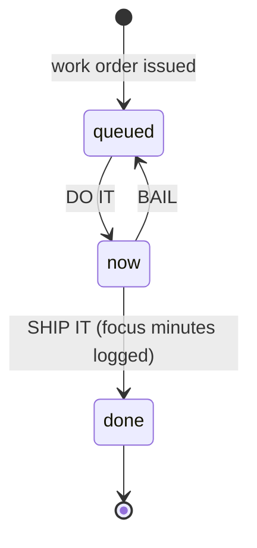
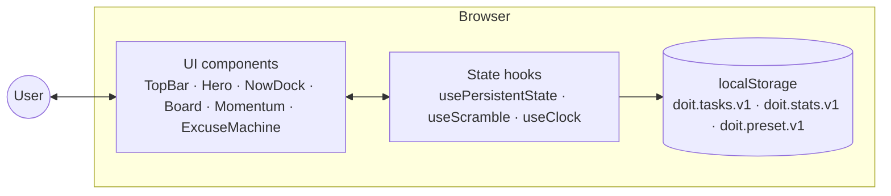

--- README.md (原始)
# DO/IT — Execution Board

A brutalist productivity app for people who are done negotiating with themselves.
Queue the work, press the button, run the clock, ship the thing.

Built with **React + TypeScript + Vite + Tailwind CSS v4**.

## What it does

- **Work Order intake** — add the tasks you've been avoiding, tag them `NOW` / `SOON` / `LATER`, queue them up. Press `/` anywhere to grab the input, `Enter` to submit.
- **Now Dock** — one task at a time. Run a focus round (5 / 15 / 25 / 45 min), pause/resume, then **SHIP IT** (early is fine — focus time is logged) or **BAIL** back to the queue. Completing a round hits the full-screen *SHIPPED* stamp.
- **Queue** — sorted by urgency and age, with live wait times. A shipped log records every completed task with its timestamp.
- **Record** — shipped-today counter, verified focus minutes, shipping streak, and a 14-day momentum heatmap. All history lives in `localStorage` and never leaves the machine.
- **Excuse Shredder** — pick the excuse you were about to tell yourself and get typed-back, slightly judgmental comebacks from the comeback terminal.

## Design

Swiss-poster brutalism: paper and ink palette, vermilion / cobalt / sun accents, Anton display type, Archivo body, IBM Plex Mono labels — hard shadows, press physics, decode-on-load headline, scroll reveals, ambient drift, film grain. Honors `prefers-reduced-motion`.

## Develop

```bash
npm install
npm run dev        # start the dev server
npm run build      # production build → dist/
npm run typecheck  # tsc --noEmit
```

## Tech notes

- Zero runtime dependencies beyond React — all icons are hand-drawn inline SVG, timers are drift-free (`performance`-anchored end timestamps).
- State persistence via `localStorage` (`doit.tasks.v1`, `doit.stats.v1`, `doit.preset.v1`), seeded with starter data on first visit.


+++ README.md (修改后)
<h1 align="center">DO/IT — Execution Board</h1>

<p align="center">
  <b>A ruthless little task board that replaces the to-do list with a shipping line.</b><br/>
  Queue the work, press the button, run the clock, ship the thing.
</p>

<p align="center">
  
</p>

<p align="center">
  
  
  
  
  
</p>

<p align="center">
  <a href="#-run-it-locally"><b>Run it</b></a> •
  <a href="#-how-it-works"><b>How it works</b></a> •
  <a href="#-architecture"><b>Architecture</b></a> •
  <a href="https://github.com/amarpatro08-dot/COOL_NAME/issues"><b>Report a bug</b></a>
</p>

---

## 🎯 Why this exists

Modern to-do apps are **infinite parking lots**. They let you collect tasks, color-code them, nest them into projects — and feel productive while doing nothing. The list grows, the guilt grows, nothing ships.

**DO/IT is the opposite shape of tool.** It is deliberately narrow:

- You can hold **exactly one task in progress** at a time.
- Every task gets an urgency tag and a **hard "DO IT" commit action**.
- Shipping is celebrated loudly; bailing puts the task back where everyone can see it.
- A focus timer turns "I'll do it later" into a **25-minute countdown that is already running**.

It's for developers, writers, and chronic planners who need a tool with **opinions**, not another inbox.

## ✨ Features

- ⚡ **Work Order intake** — add what you're avoiding, tag it `NOW / SOON / LATER`, queue it with `Enter` (press `/` from anywhere to grab the input)
- 🎯 **Single-slot NOW dock** — one task in play, big focus ring, zero multitasking
- ⏱ **Focus timer** — 5 / 15 / 25 / 45-minute rounds with start, pause, resume and a live progress bar
- 🚢 **SHIP IT / BAIL flow** — finishing logs the task with its focus minutes; bailing returns it to the queue, visibly
- 📈 **Momentum record** — shipped-today vs. daily target (5), verified focus minutes, shipping streak, 14-day activity heatmap
- ✂️ **Excuse shredder** — pick the excuse you were about to make ("I'll start Monday…") and get a typewritten comeback in a terminal panel
- 💾 **Local-first persistence** — tasks, stats, and timer preset survive reloads via `localStorage`
- ♿ **Motion-aware** — every animation honors `prefers-reduced-motion`
- 🖥 **Fully client-side** — no server, no account, no API keys; your list never leaves the machine

## 🖥 Product walkthrough

> Screenshots are not committed yet. Capture these four screens and drop them into
> `docs/screenshots/`, then uncomment the block below:
>
> | Shot | What to show |
> |---|---|
> | `01-hero.png` | The poster opening with the work-order form |
> | `02-now-dock.png` | The NOW dock with a focus round running |
> | `03-queue.png` | The queue + shipped log |
> | `04-momentum.png` | Stats, streak, and the 14-day heatmap |

<!--
<table>
<tr>
<td width="50%"></td>
<td width="50%"></td>
</tr>
<tr>
<td width="50%"></td>
<td width="50%"></td>
</tr>
</table>
-->

## ⚙️ How it works

The whole product is a **three-state machine** with one rule: only one task can be `NOW`.



1. **Queue** — tasks are sorted by urgency weight, then age. `NOW`-tagged work always floats to the top.
2. **Commit** — `DO IT` moves exactly one task into the dock; if another was running, it's demoted back to the queue.
3. **Clock** — the timer stores an absolute `endsAt` timestamp, so pausing, resuming, and completion stay accurate.
4. **Ship** — finishing increments the day's `done` count, adds the focused seconds, feeds the streak and heatmap, and stamps the task into the shipped log with its clock time.

## 🏗 Architecture

A single-page React app with zero backend. State lives in hooks and is mirrored to `localStorage` on every change.



| Layer | Contents |
|---|---|
| **Presentation** | `src/components/` — ten focused components, all custom SVG iconography, hand-rolled CSS design system |
| **State & logic** | `src/lib/data.ts` (types, urgency weights, streak math, formatters) and `src/lib/hooks.ts` (persistence, scramble-decode, clocks, motion detection) |
| **Persistence** | `localStorage` under three namespaced keys — no network calls anywhere |
| **Build** | Vite 6 + TypeScript 5.7 with strict type-checking (`npm run typecheck`) |

## 🧰 Tech stack

| Area | Technology |
|---|---|
| **UI** | React 18, TypeScript |
| **Styling** | Tailwind CSS 4 + custom design tokens (Anton / Archivo / IBM Plex Mono) |
| **Build** | Vite 6 |
| **Persistence** | Web Storage API (`localStorage`) |
| **Animation** | CSS keyframes + IntersectionObserver, with `prefers-reduced-motion` fallbacks |
| **Backend** | None — intentionally |

## 📁 Project structure

```text
.
├── index.html
├── docs/
│   └── assets/banner.svg          # README banner
├── src/
│   ├── App.tsx                    # state machine owner, section composition
│   ├── main.tsx
│   ├── index.css                  # design system: tokens, shadows, motion
│   ├── components/
│   │   ├── TopBar.tsx             # clock, day-of-year, streak
│   │   ├── Hero.tsx               # scramble headline + work-order form
│   │   ├── NowDock.tsx            # single-task focus timer
│   │   ├── Board.tsx              # queue + shipped log
│   │   ├── Momentum.tsx           # stats + 14-day heatmap
│   │   ├── ExcuseMachine.tsx      # typewriter comeback terminal
│   │   ├── Ticker.tsx · Reveal.tsx · Icons.tsx · Footer.tsx
│   └── lib/
│       ├── data.ts                # types, seeds, streak/date math
│       └── hooks.ts               # persistence, scramble, clocks
├── package.json
├── tsconfig.json
└── vite.config.js
```

## 🚀 Run it locally

Requires **Node 18+**. No environment variables, no accounts.

```bash
git clone https://github.com/amarpatro08-dot/COOL_NAME.git
cd COOL_NAME
npm install
npm run dev        # → http://localhost:5173
```

Other scripts:

```bash
npm run build      # production build → dist/
npm run typecheck  # tsc --noEmit
```

## 🧠 Engineering decisions worth noting

- **Absolute-time timer** — the countdown stores `endsAt = Date.now() + remaining` rather than decrementing a counter, so throttled tabs and pauses can't drift the clock.
- **`usePersistentState` hook** — one generic hook mirrors any state slice to `localStorage` with corrupt-JSON and quota-failure guards; the app runs fine in-memory if storage is unavailable.
- **Single-slot concurrency by construction** — the "only one NOW task" rule is enforced in the reducer-style update functions, not by UI tricks, so the invariant can't be broken by rapid clicks.
- **Streak math that respects today** — the streak counts back from yesterday unless today already has a ship, so an early-morning visit doesn't look like a broken streak.
- **Motion budget** — scramble-decode headlines, marquees, and scroll reveals all collapse to static content under `prefers-reduced-motion`.
- **Seeded demo history** — first run ships with 13 days of plausible activity so the heatmap and streak demonstrate themselves; real usage overwrites it day by day.

## 🔮 Future improvements

- Cross-tab sync via `storage` events
- JSON export/import of the record
- PWA manifest + offline caching of the static build

## 🤝 Contributing

This is a personal project, but issues and ideas are welcome — open an
[issue](https://github.com/amarpatro08-dot/COOL_NAME/issues) and describe the behavior.

## 📄 License

No license has been added yet — all rights reserved by the author for now.
If you'd like to reuse this, open an issue to discuss adding one.

---

<p align="center">
  <b>THE WORK DOESN'T CARE HOW YOU FEEL ABOUT IT.</b><br/>
  <sub>Queue it. Clock it. Ship it. Then do the next one.</sub>
</p>
